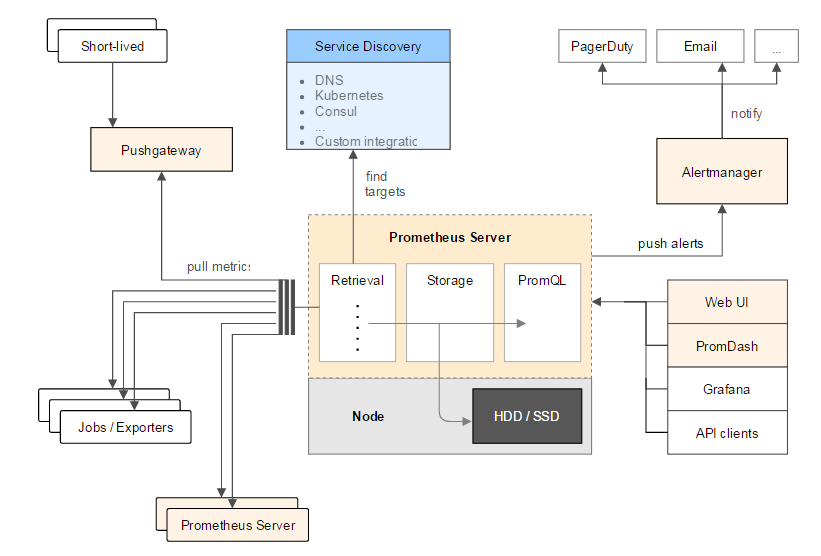

概述
======

##什么是Prometheus?
[Prometheus](https://github.com/prometheus)是一个最初在[SoundCloud](http://soundcloud.com/)上构建的开源的系统监控和告警工具包.自2012年成立以来,许多公司和组织都采用了Prometheus,该项目拥有非常活跃的开发人员和社区.
它现在是一个独立的开源项目，并独立于任何公司维护。 为了强调这一点并澄清项目的治理结构，Prometheus于2016年加入了Cloud Native [Computing Foundation](https://cncf.io/)，作为[Kubernetes](http://kubernetes.io/)之后的第二个托管项目。

##特性
Prometheus的主要特性有:
- 多维数据模型(由metric名和key/value组成的时间序列)
- 灵活的查询语言
- 不依赖分布式存储，单节点自治
- 通过http协议收集时间序列(pull model)
- 通过中间网关支持推送时间序列
- 目标通过服务发现或者静态配置发现
- 支持多种模式的图形和仪表板

##组件
Prometheus生态系统由多个组件组成，其中许多组件是可选的：
- [Prometheus server](https://github.com/prometheus/prometheus) 收集并且存储时间序列
- 用于检测应用程序代码的[客户端](https://prometheus.io/docs/instrumenting/clientlibs/)
- 用于支持短期作业的[推送网关](https://github.com/prometheus/pushgateway)
- 基于Rails/SQL的[GUI仪表构建器](https://prometheus.io/docs/visualization/promdash/)(GUI-based dashboard builder)
- 特殊用的[exporters](https://prometheus.io/docs/instrumenting/exporters/)（用于HAProxy，StatsD，Ganglia等）
- [告警管理](https://github.com/prometheus/alertmanager)(实现)
- 一个[命令行查询工具](https://github.com/prometheus/prometheus_cli)
- 各种支撑工具

大多数Prometheus组件是用Go编写的，使它们易于构建和部署为静态二进制文件。

##架构
下图说明了Prometheus及其一些生态系统组件的总体架构：

Prometheus直接或者通过短期工作的推送网关从检测jobs中收集指标, 它在本地存储所有抓取的样本生成新的时间序列，或对此数据进行规则匹配超越规则的生成警报。 PromDash或其他API使用者可用于可视化收集的数据。

####何时适用？
Prometheus适用于记录任何纯数值时间序列。 它适合以机器为中心的监控以及高度动态的面向服务的体系结构的监控。 在微服务领域，其对多维数据收集和查询的支持是一个特别的优势。

Prometheus专为可靠性而设计，可以在您的系统中断期间访问，以便您快速诊断问题。 每个Prometheus服务器是独立的，不依赖于网络存储或其他远程服务。 当基础设施的其他部分被破坏时，您可以依赖它，并且您不必设置复杂的基础设施来使用它。

####何时不适用?
Prometheus重视可靠性。 您可以随时查看有关您的系统的可用统计信息，即使在故障情况下。 但是如果您需要100％的准确性，例如对于每个请求的计数，Prometheus不是一个好选择，因为收集的数据可能不会是详细和完整的。 在这种情况下，最好是使用一些其他系统收集和分析数据进行计费